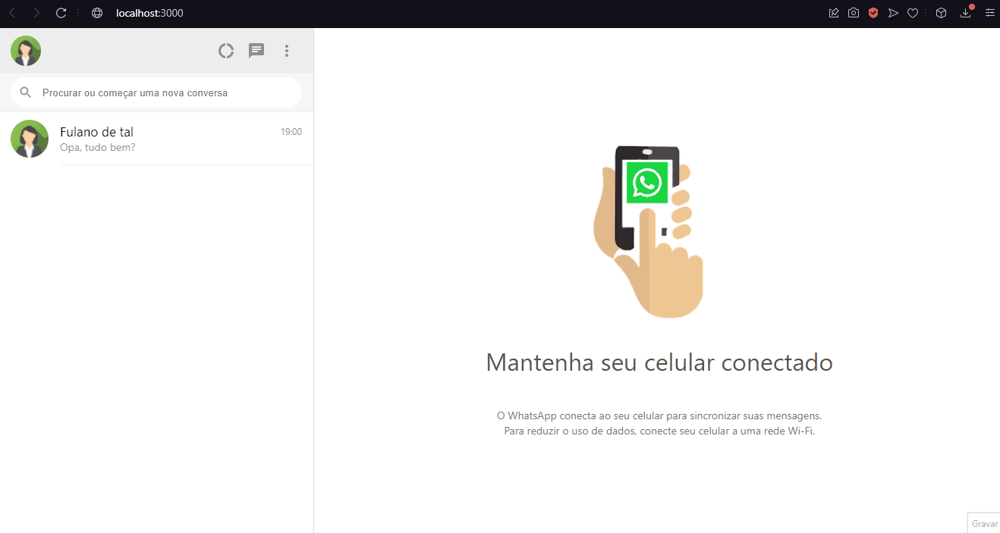

<h1>Clone WhatsApp</h1>
<h4>Em desenvolvimento...</h4>
<h2>Sobre</h2>

<p>Clone do WhatsApp, escolha um dos contatos, mande a mensagem a irá ver a mensagem na tela!</br>
Pretendo inserir o tema escuro!
</p>

### Features
- [x] Inserir Mensagens
- [] Tema Escuro

<h1>
    
</h1>

### Pré-requisitos
Antes de começar, você vai precisar das seguintes ferramentas: [Git](https://git-scm.com), [Node.js](https://nodejs.org/en/) e um editor de código, como o [VSCode](https://code.visualstudio.com/)

### Rodando o projeto
```bash
# Clone este repositório
git clone https://github.com/MalcolmMello/whatsappClone

# Acesse a pasta do projeto pelo seu terminal
cd whatsappClone

# Instale as dependências
npm install

# Inicie a aplicação
npm start

# O servidor irá rodar na porta:3000 - acesse <http://localhost:3000>

```

### Tecnologias
- React

---

Feito no curso B7Web (funcionalidade adicionar a mensagem na tela feita por mim) - [Meu LinkedIn](https://www.linkedin.com/in/malcolm-de-mello-a8208a224/)
